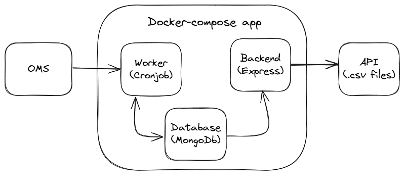

# OMS INTEGRATION

Simple backend application based on a modular monolith approach. Includes a worker for fetching new/updating data from the OMS, an authorized backend API for accessing stored data and providing it as CSV files, and a shared database layer for consistent data access.

Designed for easy extensibility, database replacement, and seamless integration with Order Management Systems (OMS).

Built with Express.js, MongoDB, and Cron.

## Dataflow schema



## Instalation

1. Clone the repository

```bash
git clone  https://github.com/Piootrekk/oms-integration.git
```

2. Make sure to create .env file in root based on .env.example

3. Run docker-compose

```bash
docker-compose up --build
```

4. Without docker: run npm i and run command commands: npm run dev:worker npm run dev:api (check package.json)
